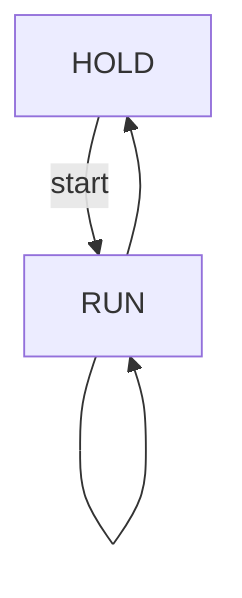

# A2: Core Invariants

This note summarises the minimal invariants for the Phi16 core and how they
are verified.

## Flow of `RUN`/`HOLD`

### Acceptance criteria
1. `TypeOK` – state is either `RUN` or `HOLD` and `data` is a binary vector.
2. `NoWriteInHold` – `data` is never modified while the core is in `HOLD`.

## Typical Failure Points

| Symptom | Response |
| --- | --- |
| TLC reports `NoWriteInHoldStruct` violation | Ensure the `Hold` action leaves `data` unchanged. |
| Model stuck in `HOLD` | Check state transitions and constants such as `EPS`. |
| `INV_TypeOK` fails | Re‑check initialisation and signal widths. |

