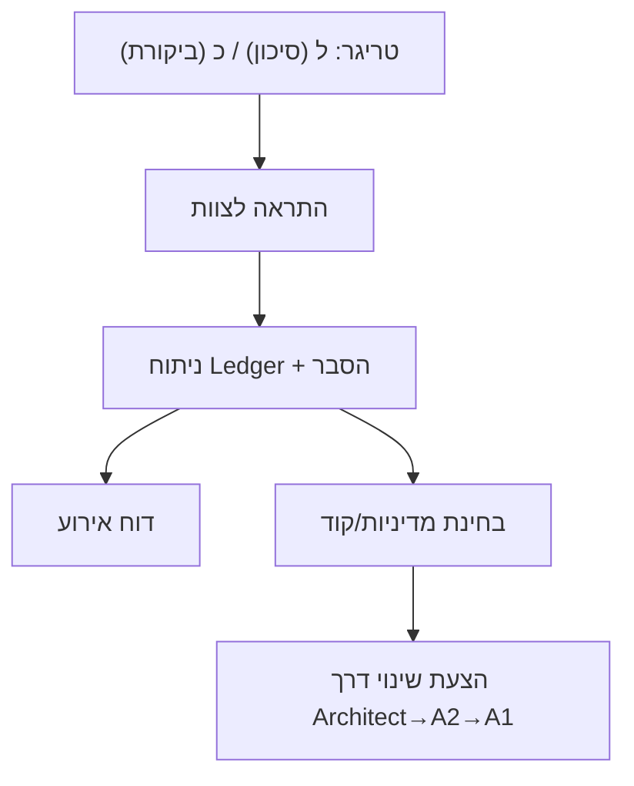

# תקן Φ-16 — גרסה 1.0 (Markdown)

> ארכיטקטורת **אחריות מוכחת** למערכות מורכבות: R/DIA · NAND-only · Proposal≠Commitment
> חלוקה פונקציונלית: **A1** (מוסר/שקט), **A2** (אינבריאנטים), **B1** (ניהול/החלטה), **B2** (רישום/בטיחות)

---

## תוכן עניינים

1. תקציר מנהלים
2. עמודי תווך: R/DIA · NAND-only · Proposal≠Commitment
3. פירוק המערכת (A1/A2/B1/B2)
4. Φ-Architect (C0⊕T0): חוזה, פורטים ו־FSM
5. DIA: הסבר + הגדרות פורמליות + Early-Stop
6. 3⊥+1: מיזוג הפיך כמונואיד Append-Only
7. SAFE/HOLD: מדיניות, אינבריאנטים ומעברים
8. OpenDecision-SSM: N_guard, Holm/BH וטבלת סיכון
9. PPCD × QTPU-Φ: צנרת איתות→אבחון
10. SSOT: סכמת JSON למקור אמת יחיד
11. סימולציה ו-CI: יעדים, בדיקות ומטרות Make
12. NAND-only בפועל: הנחיות HW/IR ותוכנה + ערוצי-צד
13. B2 Playbook: תרחישי SAFE וביקורת (Mermaid)
14. קריטריוני קבלה ל-v0.9
15. מפת־דרך (6 שבועות)
16. מונחים (Glossary)

---

## 1) תקציר מנהלים

Φ-16 הוא תקן ארכיטקטוני שמעמיד **אחריות** לפני יעילות: כל שינוי מצב נרשם כיֵּצֶר אירוע ביומן append-only; כל החלטה עוברת **שומרי סף** מוסריים ומבניים; וכל חישוב מבודל אל **NAND-only** כדי לפשט אימוּת. מנגנון הממשל **Proposal≠Commitment** מבטיח שאין "דלתות אחוריות": הארכיטקט מציע בלבד; האישור והביצוע מופרדים ושקופים.

---

## 2) עמודי תווך

### R/DIA — זיכרון כאחריות

* **R-Invariant:** אין שינוי מצב ללא אירוע ביומן (event sourcing).
* **DIA (Density of Imputable traces):** מדד איכות היסטוריית ההחלטה (גרף/מידע/שחזור).
* **כלל מונוטוניות:** DIA לא יורד; ירידה מעבר לסף τ ⇒ עצירת SAFE.

### NAND-only — מינימליזם לאימות

* פרימיטיב יחיד (NAND) בכל שכבות הלוגיקה/IR.
* הקלה דרמטית של אימות פורמלי ושוויון-התנהגות (equivalence).

### Proposal ≠ Commitment — ממשל מובנה

* **Φ-Architect** מציע (Proposer-Only).
* **A2** מאמת מבנית; **A1** מטיל וטו מוסרי; **B1** מפעיל; **B2** מתעד/מגן.

---

## 3) פירוק A1/A2/B1/B2 (תמצית)

| רביע   | מפתח             | תפקיד        | שומרי סף/מודולים                             |
| ------ | ---------------- | ------------ | -------------------------------------------- |
| **A1** | א, ב             | מוסר/שקט     | Moral-Witness, Silence-Hold                  |
| **A2** | ג, ד, ה, ו       | אינבריאנטים  | R-Gate (AND-0+), DIA-Monitor, 3⊥+1, MaxaNAND |
| **B1** | ז, ח, ט, (י\*)   | ניהול/החלטה  | Vector-Architect, OpenDecision-SSM, QTPU-Φ   |
| **B2** | כ, ל, מ, נ, ס, ע | בטיחות/רישום | Ledger/Audit, SAFE-Policy, Rollback          |

\* רכיב י יכול לשמש כקלט/אוזניים פאסיביות.

---

## 4) Φ-Architect (C0⊕T0)

**פורטים**

* **inputs:** `Y_in`, `CFG_req`, `DIA_tick`, `δ_guidance`
* **outputs:** `CFG_proposed`, `Evidence_bundle`, `Audit_event`, `Hold_signal`

**חוזה (Guarded Interface)**

* No-Write: הארכיטקט אינו כותב למצב.
* Proposal≠Commitment: לפני `VALIDATED` אין Append.
* Merge רק דרך A2-ה (3⊥+1) + Audit מלא.

**FSM (מצבים):** `C-only` · `T-only` · `CT-Unified` · `HOLD` · `SAFE`

```mermaid
flowchart LR
  IN[Y_in] --> V(MaxaNAND: ו)
  V --> G{R-Gate: ג (AND-0+)}
  G -- Pass --> M[3⊥+1: ה → Ledger (כ)]
  M --> Q[QTPU-Φ: ט]
  G -- Fail --> H[HOLD]
  Q -->|SSM| B1
  B1 --> L{SAFE policy: ל}
  L -- Block --> S[SAFE]
  L -- Permit --> ACT[Actuation]
```

---

## 5) DIA — הגדרות פורמליות + Early-Stop

**משוקלל (ברירת מחדל שמרנית):**

$$
\mathrm{DIA}(t)= w_g\cdot DIA_{\text{graph}} + w_i\cdot DIA_{\text{info}} + w_r\cdot DIA_{\text{replay}}
$$

עם $w_g{=}0.5, w_i{=}0.3, w_r{=}0.2$.

* **DIA_graph:** צפיפות/צידוד גרף הצדקות: $|E|/ (|V|\cdot(|V|-1))$ או יחס קשתות מוצדקות ל־|V|.
* **DIA_info:** אנטרופיית שאנון של מטא-דאטה תיאורי אירוע.
* **DIA_replay:** בוליאני/אחוז הצלחה של replay על חלונות.

**Early-Stop:**
אם $DIA_{t+1} < DIA_t - \tau$ ⇒ SAFE; אם AND-0+ נכשל ⇒ HOLD.

---

## 6) 3⊥+1 — מונואיד Append-Only

* **קבוצה:** כל רצפי אירועים $S$.
* **איבר יחידה:** $\langle \ \rangle$.
* **פעולה:** Append/Concatenate (אסוציאטיבי; יחידה ניטרלית).
* **Replay:** fold דטרמיניסטי של האירועים; **Rollback:** prefix.

> מזה מבטיחים **immutability** ויכולת שחזור כחלק מה-R-Invariant.

---

## 7) SAFE/HOLD — מדיניות ומעברים

* **HOLD:** כשל קונצנזוס (AND-0+). **No-Write-in-HOLD**.
* **SAFE:** כשל מדיניות (DIA/סיכון). **No-Write-in-SAFE**.
* **Recover:** חזרה ל-RUN רק כש־AND-0+ מתקיים ו-DIA עומד בסף.

**אינבריאנטים (רעיון):**

* `AppendOnlyMonotone`: אורך ה-Ledger לא קטן.
* `ProposalNotCommitment`: לפני VALIDATED אין Append.
* `DiaNondecreasing`: כאשר τ=0 (קריטי), DIA לא יורד.

---

## 8) OpenDecision-SSM — ניהול החלטות שמרני

**Risk→Method**

| חומרת סיכון | יעד  | שיטה               | שימוש                     |
| ----------- | ---- | ------------------ | ------------------------- |
| קריטית      | FWER | Holm-Bonferroni    | שינויים בלתי-הפיכים/אבטחה |
| סטנדרטית    | FDR  | Benjamini-Hochberg | אופטימיזציה שוטפת         |
| חקירתית     | FDR  | Benjamini-Hochberg | גילוי/סינון ראשוני        |

**פסאודו-קוד (תמצית):**

```text
if !DIA_check(): return SAFE
if risk == "critical":    # Holm
  for k in 1..m:
    if p_(k) > α/(m-k+1): return reject(1..k-1)
  return reject(1..m)
else:                      # BH
  k* = max { k : p_(k) <= (k/m)*q }
  return reject(1..k*)
```

---

## 9) PPCD × QTPU-Φ — איתות ואבחון

* **PPCD:** מפת קוהרנטיות הסתברותית (שדה/גרדיאנט) לאיתור אזורים *מעניינים*/חריגים.
* **QTPU-Φ:** הפרדת אי-ודאות (אפיסטמית/אליאטורית) + היטל משמעות היררכי.
* **יד־ביד:** PPCD מסמן, QTPU-Φ מאשר/מקטלג, SSM מחליט.

---

## 10) SSOT — סכמת JSON (סקיצה)

```json
{
  "$schema": "https://json-schema.org/draft/2020-12/schema",
  "title": "Phi16 SSOT",
  "type": "object",
  "properties": {
    "ports": { "type": "object",
      "properties": {
        "inputs": {"type":"array","items":{"type":"string"}},
        "outputs":{"type":"array","items":{"type":"string"}}
      }, "required":["inputs","outputs"]
    },
    "invariants": {"type":"array","items":{"type":"string"}},
    "DIA": {"type":"object",
      "properties":{
        "weights":{"type":"object","properties":{
          "w_g":{"type":"number"}, "w_i":{"type":"number"}, "w_r":{"type":"number"}
        },"required":["w_g","w_i","w_r"]},
        "tau":{"type":"number"}
      },"required":["weights","tau"]
    },
    "AND0plus":{"type":"object",
      "properties":{"N":{"type":"integer"},"EPS":{"type":"integer"}},
      "required":["N","EPS"]
    }
  },
  "required":["ports","invariants","DIA","AND0plus"]
}
```

---

## 11) סימולציה ו-CI (יעדים)

* **sim:** חישוב `DIA_graph/info/replay`, טריגרים SAFE/HOLD לפי `tau`.
* **tla:** בדיקת אינבריאנטים (AppendOnly, No-Write-in-SAFE/HOLD, Proposal≠Commitment).
* **lint-ir:** איתור `|| && ^` בקוד → כשל CI.

**Make (סקיצה):**

```make
sim:    python3 tools/sim_replay.py examples/events.json
tla:    tlc spec/tla/Phi16SAFE.tla -config spec/tla/Phi16SAFE_EPS0.cfg
lint:   python3 tools/nand_ir_checker.py src/**/*.*
```

---

## 12) NAND-only בפועל

**HW/IR**

```verilog
// OR(a,b) בלבני NAND
wire na, nb;
nand n1(na, a, a);
nand n2(nb, b, b);
nand n3(out, na, nb);
```

**SW**

```python
def nand(a: bool, b: bool) -> bool: return not (a and b)
def logical_not(a): return nand(a,a)
def logical_or(a,b): return nand(logical_not(a), logical_not(b))
```

**ערוצי-צד/Timing:** ניתוח STA; נרמול זמני/הספק (dummy ops); שמירת מרווחי δ (QTPU).

---

## 13) B2 Playbook — תרחישים



* **SAFE:** בלימת פעולה, No-Write, תחקיר.
* **Audit:** שליפה לפי מזהה/זמן/מטא-דאטה; Rollback מבוקר בסביבת בדיקה.

---

## 14) קריטריוני קבלה (Gate v0.9)

* EPS=0/1: אינבריאנטים עוברים בבדיקה.
* No-Write-in-SAFE/HOLD: מוכח מודלית.
* DIA לא יורד (τ=0) בפרופיל "קריטי".
* CI ירוק (`sim`, `tla`, `lint-ir`).
* Playbook זמין וחתום.

---

## 15) מפת-דרך (6 שבועות)

* **שבוע 1–2:** PPCD Heatmap + סט דוגמאות חריגים.
* **שבוע 3–4:** QTPU-Φ (אפי/אליא) + סיווג על-מבני.
* **שבוע 5:** אינטגרציית SSM + Ledger/Replay + SAFE thresholds.
* **שבוע 6:** חבילת סימולציה + דו״ח DIA (חלונות מתגלגלים).

---

## 16) מונחים

* **R/DIA:** זיכרון כאחריות; צפיפות עקבות.
* **AND-0+:** דרישת קונצנזוס $\sum W_i·OK_i \ge N-ε$.
* **3⊥+1:** מיזוג הפיך דרך append + גרסאות.
* **SAFE/HOLD:** עצירה מדיניות/קונצנזוס.
* **PPCD/QTPU-Φ:** איתות קוהרנטיות ↔ אבחון אי-ודאות/משמעות.
* **SSM:** צנרת החלטות סטטיסטית (N_guard, Holm/BH).

---

> מוכן לשילוב ברפו כ־`docs/standard_phi16_v1.md` או לרינדור PDF עם תוכן עניינים. אם תרצה—אוסיף גרסת PDF מעוצבת עם איורים.

